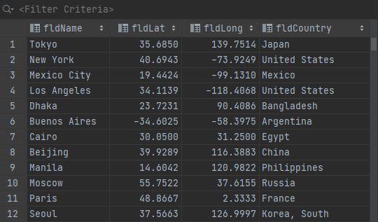
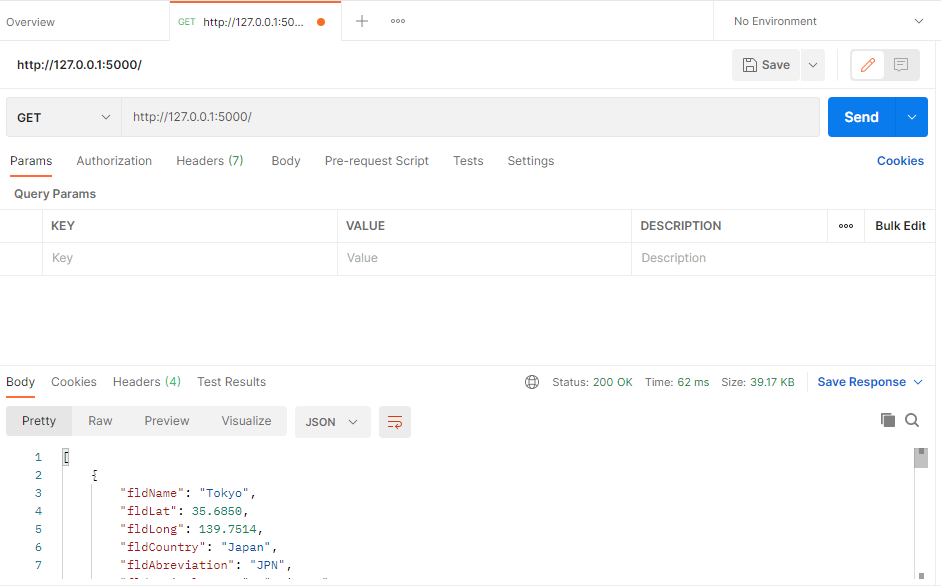
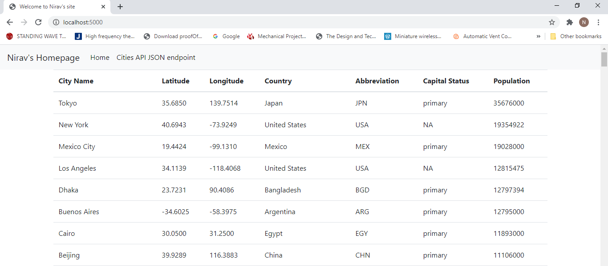

# Project Description
This project is a homework assignment to teach how to get Pycharm setup with Docker, Flask, MySQL, and Postman

[Download Assignment PDF Here](PPFSQL-Homework.pdf)

[View Assignment Video Here](https://youtu.be/QbMWNgrfAFg)

# Submission Requirements:
* SQL Data Screenshot(Part 1)

  
* Postman Screenshot (Part 1)

* Website Screenshot (Part 2)

  
* Part3 screenshots are included in word file.
  
  

  
